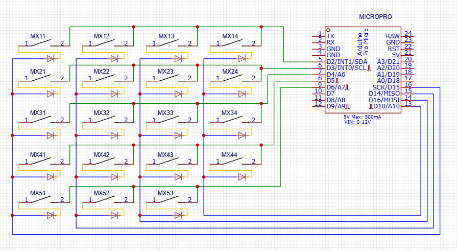
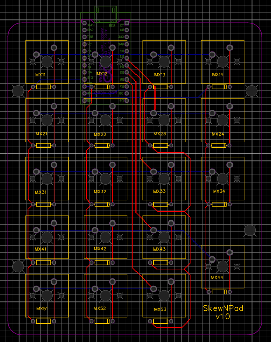

# SkewNPad

SkewNPad, 4 x 5 numpad / macropad with QMK firmware

IMG
[skewnpad](replace me)
TODO le prendre en photo

## Electric schema

## Electronic schema

Gerber file is available [here](files/Gerber_SkewNPad.zip) (PCB fabrication zip file)

## Soldering
Now, you need to solder all parts :
- All 19 switches at the top
- All 19 diodes at the top
- Arduino micro pro at the bottom

## 3D printing
- bottom_case x 1
- top_case x 1
- snap_clip x 4

## QMK firmware (Windows version)
- Install MSYS2 (Mingw64)
- Set the environment variable PYTHONUTF8 to "1"
- In Mingw64 :
  - `curl -fsSL https://install.qmk.fm | sh`
  - `export PATH="/opt/uv/tools/bin:$PATH"`
  - `qmk setup`
  - `qmk new-keyboard`
- Copy files without `files` and `images` folders into the keyboard directory.
  - `qmk compile -kb skewnpad -km default`
- Flash Arduino micro pro
  - Put arduino in `Bootloader mode`, by shunting two times RST and GND pins (connect them together with a screwdriver or else).
  - Within the 8 next seconds : `qmk flash -kb skewnpad -km default`

## VIA configuration
Go to [VIA app](https://www.usevia.app/)
- Go to Settings tab
- Enable `Show Design tab`
- Go to Design tab
- `Load Draft Definition`
- Load [SkewNPad VIA file](files/VIA/Skewnpad%20VIA.json)
- Plug the macropad and go to `Configure` tab to associate it
- Use [SkewNPad layout file](files/VIA/Skewnpad%20layout.json) ## TODO mettre le nouveau

TODO screenshot de VIA avec les deux layouts principaux